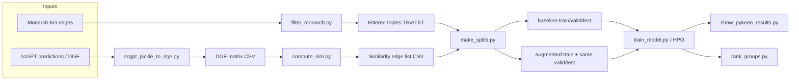

# scGPT-augmented knowledge graph embeddings for rare disease gene prediction

This repository studies **link prediction on the Monarch knowledge graph (KG)** with an optional **train-set augmentation** from **scGPT** perturbation profiles. The idea is to add *gene–gene* edges that reflect high similarity in predicted differential expression (DGE) after CRISPR-style perturbations, map those genes to **HGNC** identifiers, and retrain **knowledge graph embedding (KGE)** models (via [PyKEEN](https://github.com/pykeen/pykeen)) to improve or analyze predictions for **rare-disease–relevant** relations—especially under **degree imbalance** and **group-wise** (e.g. ancestry- or disease-group) evaluation.

A high-level view of the intended pipeline:

---

## Repository layout (excluding `scGPT_integration/`)

| Path | Role |
|------|------|
| `src/` | Python entry points and small shell drivers for the pipeline (see [Scripts](#scripts) below). |
| `data/MonarchKG/` | Monarch graph assets used here: `monarch-kg_edges.tsv`, `monarch-kg_nodes.tsv`, and `HGNC_to_symbol.tsv` (symbol → HGNC ID for merging scGPT edges). |
| `data/BOB_disease_groups/` | Curated **MONDO** term lists, gene sets, and related files for **grouped ranking** and evaluation (e.g. disease buckets, random controls). |
| `data/scGPT_knockout_dge.csv` | Example / working **DGE matrix** (perturbations × genes) for similarity and downstream steps. |
| `out/` | Typical location for **generated** artifacts: filtered KG, cosine (or other) similarity CSVs, and `KG_split/…` **baseline vs augmented** splits. *(Many patterns are git-ignored; recreate via scripts.)* |
| `src/ipynb/exploration.ipynb` | Ad hoc exploration. |

> **Note:** The folder `scGPT_integration/` is a separate experimental snapshot; this README describes the main tree above only.

---

## Scripts

All Python tools live under `src/` and are meant to be run from the **repository root** (paths in examples assume that).

### Data preparation

| Script | What it does |
|--------|----------------|
| **`filter_monarch.py`** | Restricts a Monarch edge table to triples whose **subject** and **object** use allowed ID prefixes (default: `MONDO:`, `HGNC:`, `HP:`). Writes `filtered_KG.txt` (tab-separated triples, no header). |
| **`scgpt_pickle_to_dge.py`** | Converts a **`multi_gpu_predictions.pkl`**-style dict of prediction vectors (plus a **control mean** and **gene name** list) into a **DGE CSV** (rows = perturbations, columns = genes). Sidecar files next to the pickle can supply gene order and control mean. |
| **`compute_sim.py`** | From a DGE matrix CSV, builds a full **similarity matrix** (cosine, Pearson, or Spearman) and optionally exports **top‑k** pairs with `--min_sim` threshold as a long-format CSV for `make_splits.py` (`gene_a`, `gene_b`, &lt;metric&gt;). |

### Splits and augmentation

| Script | What it does |
|--------|----------------|
| **`make_splits.py`** | Splits the **filtered** KG into **train / validation / test** with a fixed seed. Produces **`baseline/`** (Monarch only) and **`augmented/`** (train + scGPT **similarity** edges as `biolink:correlated_perturbation` by default), mapping gene symbols to **HGNC** and keeping edges whose endpoints appear in the **training** entity set. |

### Training and hyperparameters

| Script | What it does |
|--------|----------------|
| **`train_model.py`** | Trains a single PyKEEN model (e.g. **RotatE**, **TransE**, **ComplEx**) on given `train/valid/test` triple files; NSSA loss, Adagrad, filtered evaluation, checkpointing under `--save_path`. |
| **`optimize_and_train_model.py`** | **Hyperparameter search** with Optuna’s `hpo_pipeline` (embedding dim, epochs, lr, negative sampling), early stopping, saves best run under `PyKeenOut/<study>/`. |

### Results and analysis

| Script | What it does |
|--------|----------------|
| **`show_pykeen_results.py`** | Prints **Hits@k**, MRR, mean rank, etc. from a PyKEEN **`results.json`**; optional **side‑by‑side** compare of baseline vs augmented run. |
| **`plot_threshold_comparison.py`** | Aggregates **multiple** `results.json` files (e.g. different similarity thresholds) into comparison **plots** and a summary TSV. |
| **`plot_similarity_distribution.py`** | **Histograms** of similarity values (e.g. from a matrix-style CSV) for calibration. |
| **`plot_DGE_stats.py`** | **EDA** on a DGE CSV: global and per-perturbation distributions, sparsity-style views. |
| **`rank_groups.py`** | **Groupwise** link scoring: for lists of **A vs B** terms (e.g. disease groups), uses a trained model to score held-out edges and **ranks** predictions—supports Kruskal-style comparisons and rich TSV output for `plot_ranking_stats.py`. |
| **`plot_ranking_stats.py`** | **Histogram** of normalized ranks from `rank_groups.py` output and **1−MNR** (median rank) style summary. |

### Shell helpers

| Script | What it does |
|--------|----------------|
| **`compute_sim_bulk.sh`** | Loops **similarity thresholds** and calls `compute_sim.py` (expects DGE path, output prefix, metric, top_k as arguments). |
| **`make_splits_bulk.sh`** | For each similarity CSV in a folder, runs `make_splits.py` for **several fixed seeds** (42, 314, 123, 678, 9484) under `out/KG_split/…`. |
| **`HPO.sh`** | Launches **three** `optimize_and_train_model.py` jobs (RotatE, TransE, ComplEx) on one baseline split, logging to `logs/`. |

---

## Typical workflow

1. **Filter Monarch to disease/gene/phenotype nodes**  
   `python src/filter_monarch.py --input data/MonarchKG/monarch-kg_edges.tsv --output out`

2. **(If needed) Build DGE from scGPT outputs**  
   `python src/scgpt_pickle_to_dge.py --predictions_pkl <path>/multi_gpu_predictions.pkl --output_csv data/my_dge.csv`

3. **Compute similarity edges** (example: cosine, top‑k, minimum similarity)  
   `python src/compute_sim.py --dge_csv data/scGPT_knockout_dge.csv --output out/cosine_sim/pairs.csv --metric cosine --top_k 50 --min_sim 0.8`  
   Or use `src/compute_sim_bulk.sh` for a sweep of thresholds.

4. **Create baseline vs scGPT‑augmented splits**  
   `python src/make_splits.py --filtered_kg out/filtered_KG.txt --sim_csv out/cosine_sim/pairs.csv --output_dir out/KG_split/run1 --seed 42`  
   For many CSVs and seeds: `bash src/make_splits_bulk.sh out/cosine_sim out/filtered_KG.txt`

5. **Train**  
   - Single run: `python src/train_model.py --train ... --valid ... --test ... --model transe --cuda cuda:0`  
   - HPO: `python src/optimize_and_train_model.py --model transe --id my_run --train ... --valid ... --test ...` (see `HPO.sh` for a pattern).

6. **Evaluate and compare**  
   `python src/show_pykeen_results.py --baseline <baseline>/results.json --new <augmented>/results.json`  
   `python src/plot_threshold_comparison.py --run run1=... --run run2=... --output_png fig.png --output_tsv table.tsv`

7. **Rare-disease / group analysis**  
   Use term lists from `data/BOB_disease_groups/` with `rank_groups.py`, then `plot_ranking_stats.py`.

---

## Dependencies

Core libraries used in `src/`: **Python 3** with **PyTorch**, **PyKEEN**, **Optuna** (HPO), **scikit-learn**, **pandas**, **NumPy**, **Matplotlib**, **NetworkX**, **SciPy**. Install versions compatible with your CUDA setup for GPU training.

---

## Background and motivation

Knowledge graphs encode biomedical facts, but **link predictors** often favor **high-degree** “hub” nodes—patterns related to **study bias** in the literature. Augmenting the training graph with **expression-derived** gene–gene links from a foundation model (scGPT) is one way to inject complementary signal for **underconnected** genes and **rare disease** contexts. The evaluation utilities here emphasize **fair splits**, **group-wise** ranks, and **comparisons** between baseline and augmented training.